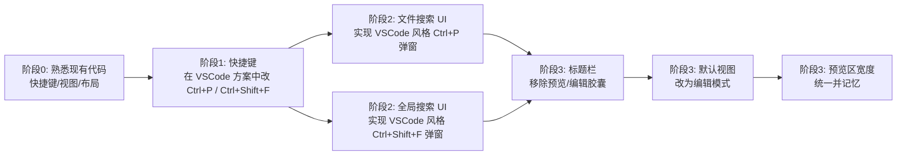

- Q:
https://github.com/tizuio/TizuMark fork了一下这个项目想把它改的跟vscode体验接近一点, 主要是: 
- 快捷键: 默认使用vscode快捷键方案; vscode快捷键方案中ctrl+p从默认打印文件改为vscode一样的文件搜索:弹出一个vscode一样的文件搜索框(不用现有的那个别扭的跨文件搜索窗口); ctrl+shift+f弹出像vscode一样的全局搜索(同样不用现有的跨文件搜索窗口)
- 界面: 移除标题栏中间的预览/编辑切换胶囊; 文件打开默认编辑模式; 编辑模式右侧的预览区宽度全局统一并且记忆手动调整的宽度
能帮我写个详细的可行的修改计划吗?

-A:
我看了 TizuMark 原项目代码结构，你的需求都能在现有基础上做“局部改造”，不用重写大模块。下面是一份**直接基于现有代码**、按你的目标梳理的详细修改计划，你可以照着一步步落地。
---
## 一、整体结论（先给你一个全局视图）
- 项目已经有多套快捷键方案：`src/index.html` 里有“快捷键设置”对话框，包括方案下拉 `shortcuts-scheme` 和快捷键列表 `shortcuts-list`。
- 已经有“跨文件搜索”对话框 `cross-search-dialog`，你现在觉得它“别扭”，想要 VSCode 风格的弹窗。
- 标题栏中间已经有“预览/编辑”切换胶囊：`.toolbar-center .view-mode-tabs` 里的 `btn-view-preview` / `btn-view-edit`。
- 编辑/预览区布局在 `.editor-row` 中：左边 `.editor-pane`，中间 `.resizer`，右边 `.preview-pane`。
- 设置里已经有“默认视图：预览 / 编辑”选项 `set-default-view`。
基于这些，我给你一个整体改造流程示意：

下面分阶段说。
---
## 二、阶段 0：先搞清楚现有关键位置（建议你先照这个看一眼）
### 1. 快捷键方案相关位置
- `src/index.html` 中有：
  - “快捷键设置”菜单项 `btn-shortcuts`。
  - 快捷键对话框 `shortcuts-dialog`，里面包含：
    - 方案选择下拉：`<select id="shortcuts-scheme">`。
    - 快捷键列表容器：`<div id="shortcuts-list">`。
- 具体快捷键逻辑大概率在 `src/app.js` 里，通过全局键盘监听 + 一个动作映射表实现（比如 `Ctrl+P` → `print`，`Ctrl+Shift+F` → 打开跨文件搜索等）。
> 你只要在 `src/app.js` 里搜索 `keydown`、`Ctrl+P`、`shortcuts-scheme` 这些关键词，就能看到具体实现。
### 2. 标题栏“预览/编辑”胶囊
- 在 `src/index.html` 里，标题栏中间有：
  ```html
  <div class="toolbar-center">
    <div class="view-mode-tabs">
      <button id="btn-view-preview" class="view-mode-tab active" title="预览模式">...预览</button>
      <button id="btn-view-edit" class="view-mode-tab" title="编辑模式">...编辑</button>
    </div>
  </div>
  ```
- 这就是你说的“预览/编辑切换胶囊”。
### 3. 编辑/预览区布局和拖拽条
- 在 `src/index.html` 的 `<main class="editor-container">` 内有：
  ```html
  <div class="editor-row">
    <div class="editor-pane" id="editor-pane">...</div>
    <div class="resizer" id="resizer"></div>
    <div class="preview-pane" id="preview-pane">...</div>
  </div>
  ```
- `.resizer` 就是中间可拖拽的分隔条，用来调整编辑/预览宽度。
- 宽度控制应该在 JS 里监听 `resizer` 的 `mousedown/mousemove/mouseup`，动态设置 `.preview-pane` 的宽度（或 `flex` 比例）。
### 4. 默认视图设置
- 设置里有：
  ```html
  <label>默认视图</label>
  <select id="set-default-view">
    <option value="preview" selected>预览</option>
    <option value="edit">编辑</option>
  </select>
  ```
- 现在默认是“预览”，你想改成默认“编辑”。
---
## 三、阶段 1：快捷键 —— 让 VSCode 方案里的 Ctrl+P / Ctrl+Shift+F 触发你要的新 UI
### 1. 定位现有快捷键注册逻辑
在 `src/app.js` 中搜索：
- `keydown` / `keypress`
- `Ctrl+P` / `Ctrl+Shift+F`
- `shortcuts-scheme`（或 `shortcuts-list`）
大概率是类似这种结构（伪代码示意）：
```js
// 伪代码
const keymaps = {
  default: {
    'Ctrl+P': 'print',
    'Ctrl+Shift+F': 'open-cross-search'
    // ...
  },
  vscode: {
    'Ctrl+P': 'print',         // 目前还是打印
    'Ctrl+Shift+F': 'open-cross-search'
    // ...
  }
  // 可能还有其它方案
};
```
你的目标：**只改 VSCode 方案下的两个快捷键映射，不动其它方案**。
### 2. 修改 VSCode 方案映射（第一步）
在找到的 `keymaps` / `keybindings` 对象中，把 `vscode` 方案改成：
```js
// 伪代码
vscode: {
  'Ctrl+P': 'file-search',          // 新：文件搜索弹窗
  'Ctrl+Shift+F': 'global-search',  // 新：全局搜索弹窗
  // 保持其它快捷键不变
}
```
- 原来的 `print`、`open-cross-search` 等动作名不要删掉，只是这两个快捷键在 VSCode 方案下不再对应它们。
- 在动作分发器里增加两个新的处理分支（见下一步）。
### 3. 在动作分发器中增加两个新动作
在 `src/app.js` 中找到处理快捷键动作的地方（通常是 `handleAction` / `dispatchAction` / `execAction` 等），加两个 case：
```js
// 伪代码
function handleAction(action) {
  switch (action) {
    // === 新增 ===
    case 'file-search':
      // 打开你即将实现的 VSCode 风格文件搜索弹窗
      // openFileSearchDialog();
      break;
    case 'global-search':
      // 打开 VSCode 风格的全局搜索弹窗
      // openGlobalSearchDialog();
      break;
    // === 保留原有动作 ===
    case 'print':
      window.print();
      break;
    case 'open-cross-search':
      // 原来的跨文件搜索对话框逻辑，保留给 default 方案
      break;
    // ...
  }
}
```
> 这一步先只占位，确认在 VSCode 方案下按 `Ctrl+P` 能走到 `file-search` 这个分支（可以先用 `console.log` 验证）。
---
## 四、阶段 2：实现 VSCode 风格的文件搜索 UI（Ctrl+P）
你不想用现有的“跨文件搜索”窗口，而是做一个 VSCode 那样的居中弹窗。建议直接在 `src/index.html` 里新增一个对话框，而不是改动原有的 `cross-search-dialog`。
### 1. 在 `src/index.html` 中新增文件搜索弹窗
在现有 `shortcuts-dialog` 后面插入：
```html
<div id="file-search-dialog" class="dialog-overlay hidden" role="dialog" aria-modal="true">
  <div class="dialog file-search-dialog">
    <div class="dialog-header">
      <h2>文件搜索</h2>
      <button class="dialog-close" id="file-search-close" aria-label="关闭">&times;</button>
    </div>
    <div class="dialog-content">
      <input type="text" id="file-search-input" class="file-search-input" placeholder="输入文件名筛选..." />
      <div id="file-search-list" class="file-search-list"></div>
    </div>
  </div>
</div>
```
### 2. 在 `src/styles.css` 中增加样式（示意）
```css
.file-search-dialog {
  width: 480px;
  max-width: 90vw;
  margin: 10vh auto;
}
.file-search-input {
  width: 100%;
  padding: 6px 8px;
}
.file-search-list {
  margin-top: 8px;
  max-height: 240px;
  overflow: auto;
}
.file-search-item {
  padding: 4px 8px;
  cursor: default;
}
.file-search-item:hover,
.file-search-item.selected {
  background: var(--accent-subtle);
}
```
### 3. JS 逻辑：`src/modules/file-search.js`（新建）
核心职责：
1. 打开弹窗时从当前工作区目录扫描 `.md` 文件（通过 Tauri 的文件系统 API 或你现有的“打开目录”逻辑）。
2. 根据输入内容过滤文件名。
3. 支持键盘导航（上下键 + Enter）。
4. 回车时调用你现有的“打开文件”逻辑，关闭弹窗。
示例结构：
```js
// src/modules/file-search.js
let dialog, inputEl, listEl;
export function openFileSearchDialog() {
  if (!dialog) {
    dialog = document.getElementById('file-search-dialog');
    inputEl = document.getElementById('file-search-input');
    listEl = document.getElementById('file-search-list');
    inputEl.addEventListener('input', () => {
      renderList(inputEl.value.trim());
    });
    inputEl.addEventListener('keydown', e => {
      if (e.key === 'Escape') closeFileSearchDialog();
      // 上下键导航、Enter 确认
    });
    dialog.addEventListener('click', e => {
      if (e.target === dialog) closeFileSearchDialog();
    });
  }
  // 加载当前工作区的文件列表（需你根据项目现有能力实现）
  loadFileList();
  dialog.classList.remove('hidden');
  inputEl.focus();
}
function closeFileSearchDialog() {
  dialog.classList.add('hidden');
  inputEl.value = '';
  listEl.innerHTML = '';
}
```
### 4. 与快捷键联动
在 `src/app.js` 的 `handleAction` 中：
```js
case 'file-search':
  import('./modules/file-search.js').then(mod => mod.openFileSearchDialog());
  break;
```
---
## 五、阶段 2：VSCode 风格的全局搜索 UI（Ctrl+Shift+F）
### 1. 新增全局搜索弹窗
在 `src/index.html` 中，`file-search-dialog` 后面：
```html
<div id="global-search-dialog" class="dialog-overlay hidden" role="dialog" aria-modal="true">
  <div class="dialog global-search-dialog">
    <div class="dialog-header">
      <h2>全局搜索</h2>
      <button class="dialog-close" id="global-search-close" aria-label="关闭">&times;</button>
    </div>
    <div class="dialog-content">
      <input type="text" id="global-search-input" class="global-search-input" placeholder="输入搜索内容..." />
      <div class="global-search-options">
        <label><input type="checkbox" id="global-search-case"> 区分大小写</label>
        <label><input type="checkbox" id="global-search-regex"> 正则</label>
      </div>
      <div id="global-search-results" class="global-search-results"></div>
    </div>
  </div>
</div>
```
样式略，你可以参考现有 `cross-search-dialog` 的样式做简化。
### 2. JS 模块：`src/modules/global-search.js`
- 复用现有的跨文件搜索逻辑（`cross-search-dialog` 里的 Tauri/Rust 搜索能力），只是换一个 UI。
- 在 `global-search-results` 中显示结果，点击结果可打开文件并跳转到对应行（通过 CodeMirror 的 API）。
---
## 六、阶段 3：界面改造
### 1. 移除标题栏中间的“预览/编辑切换胶囊”
两种做法，推荐先隐藏，确认没问题再删除：
#### 方案 A：CSS 隐藏（最安全）
在 `src/styles.css` 中增加：
```css
.toolbar-center .view-mode-tabs {
  display: none;
}
```
这样不影响 HTML 结构，以后想恢复也方便。
#### 方案 B：直接删除 HTML
在 `src/index.html` 中注释或删除：
```html
<!-- <div class="toolbar-center">
  <div class="view-mode-tabs">
    ...
  </div>
</div> -->
```
> 注意：如果 JS 里对 `btn-view-preview` / `btn-view-edit` 有事件绑定，可以保留按钮，只隐藏，或者移除相关事件监听。
### 2. 文件打开默认编辑模式
项目已经有“默认视图：预览 / 编辑”的设置项 `set-default-view`。你需要：
1. 在 JS 初始化逻辑中，让这个设置项默认为 `'edit'`：
   - 可以在 `src/app.js` 中读取设置时，若没有保存值，就默认 `'edit'`。
   - 或者在 `src/index.html` 里把 `selected` 放在 `edit` 上：
     ```html
     <select id="set-default-view">
       <option value="preview">预览</option>
       <option value="edit" selected>编辑</option>
     </select>
     ```
2. 确保新建标签页 / 打开文件时，视图模式走这个配置（你现有的逻辑应该已经用到了这个 `set-default-view`，如果没有，就要在“打开文件”处根据它决定视图模式）。
### 3. 预览区宽度全局统一并记忆手动调整
#### 1）统一预览区宽度控制方式
- 现在是通过 `.resizer` 拖拽 JS 改变宽度。
- 建议在 JS 中统一改成：修改一个 CSS 变量或 `.preview-pane` 的 `width`。
在 `src/styles.css` 中加：
```css
:root {
  --preview-pane-width: 360px; /* 默认宽度，可按你习惯调整 */
}
.preview-pane {
  width: var(--preview-pane-width);
  min-width: 200px;
  max-width: 800px;
}
```
然后在拖拽逻辑中，不再直接写死宽度，而是：
```js
// 拖拽结束时
document.documentElement.style.setProperty('--preview-pane-width', `${newWidth}px`);
```
这样所有窗口都会用同一个宽度。
#### 2）记忆手动调整的宽度
在拖拽结束回调中：
1. 获取当前宽度 `newWidth`。
2. 通过你现有的设置保存机制（通常是 Tauri 的配置文件或 localStorage）保存：
   ```js
   // 伪代码
   saveSettings({ previewPaneWidth: newWidth });
   ```
3. 在应用启动时读取并应用：
   ```js
   const w = loadSettings().previewPaneWidth || 360;
   document.documentElement.style.setProperty('--preview-pane-width', `${w}px`);
   ```
这样就能保证“全局统一 + 手动调整记忆”。
---
## 七、落地顺序建议（你可以按这个顺序一步步来）
1. **先改快捷键映射 + 验证**：  
   - 在 VSCode 方案中把 `Ctrl+P` → `file-search`，`Ctrl+Shift+F` → `global-search`。  
   - 在 `handleAction` 里用 `console.log` 确认能进入这两个分支。
2. **实现文件搜索弹窗**：  
   - 先实现一个简单版本：只展示当前工作区的文件列表，支持输入过滤、键盘导航、打开文件。  
   - 确认在 VSCode 方案下 `Ctrl+P` 能打开它。
3. **实现全局搜索弹窗**：  
   - 复用现有跨文件搜索能力，只改 UI。
4. **移除预览/编辑胶囊 + 改默认视图**：  
   - 用 CSS 隐藏 `.toolbar-center .view-mode-tabs`。  
   - 把“默认视图”改为“编辑”。
5. **统一预览区宽度 + 记忆**：  
   - 引入 CSS 变量 `--preview-pane-width`。  
   - 在拖拽逻辑中改用这个变量。  
   - 增加保存/加载逻辑。
---